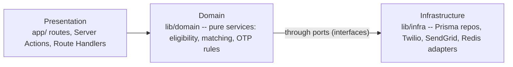
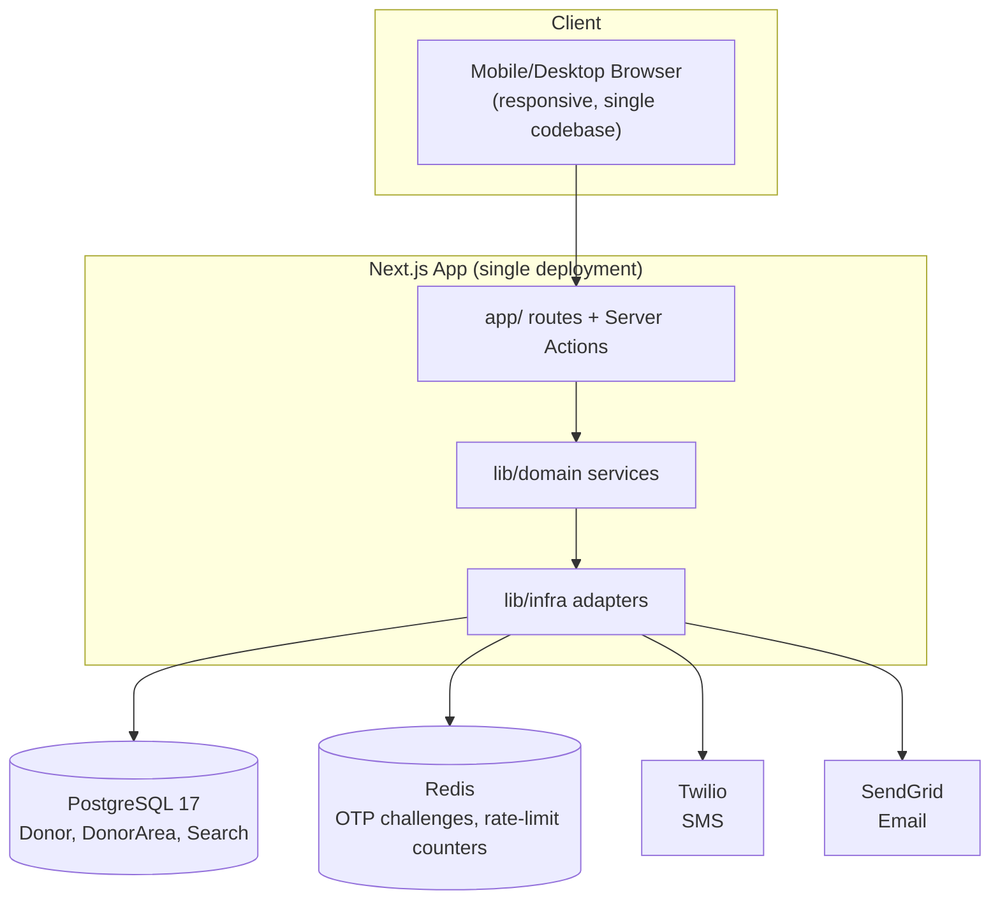
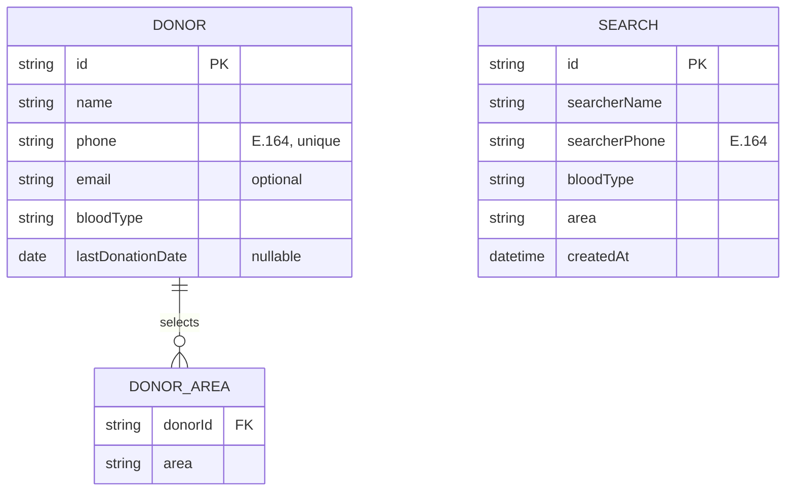

# Architecture Spine — Blood Donor Availability Matcher

## Design Paradigm

**Layered monolith with service-boundary ports.** One Next.js App Router application — no separate API server. Three layers, one dependency direction:



Domain services depend only on port interfaces, never on a concrete adapter (Prisma client, Twilio SDK) — so eligibility and matching logic are unit-testable without a database, SMS, or email in the loop. Presentation never calls Infrastructure directly.

## Invariants & Rules

### AD-1 — Searcher has no persisted identity

- **Binds:** FR-5, FR-8
- **Prevents:** A builder creating a reusable `Searcher` entity/table that then needs its own lifecycle, auth, or dedup rules never specified by the PRD.
- **Rule:** A Searcher's name and phone are inlined fields on the `Search` record only. No `Searcher` table exists.

### AD-2 — OTP challenges live only in Redis, never Postgres `[ADOPTED]`

- **Binds:** FR-2, FR-5, FR-9
- **Prevents:** Two independently-built OTP flows (Donor registration, Searcher verify, self-service entry) each inventing their own expiry/cleanup strategy — one a cron-swept table, another a TTL cache — leaving inconsistent expiry behavior.
- **Rule:** Every OTP challenge (`phone + purpose -> codeHash, expiresAt, attempts`) is a Redis key with a TTL (~5 min). No OTP table in the relational schema. All three OTP flows call one shared `otp` service.

### AD-3 — One shared rate-limit utility, not per-route logic

- **Binds:** FR-12 (registration, search, OTP endpoints)
- **Prevents:** Each endpoint hand-rolling its own counter and drifting on window size, key shape, or response format; two builders keying on different notions of "the client IP" behind Vercel's proxy chain and landing on different spoof-resistance guarantees.
- **Rule:** All rate-limited endpoints call one Redis sliding-window utility keyed by `ip + endpoint`, where `ip` is always the platform-trusted client IP (Vercel's resolved `request.ip` / the trusted last-hop value, never a raw client-supplied `x-forwarded-for` entry). The 429 response body shares one shape across all of them.

### AD-4 — Post-OTP session is a short-lived, server-enforced bearer token, not a persistent login

- **Binds:** FR-5, FR-9, FR-10, FR-11 — resolves PRD Open Question 6. Does **not** bind FR-1/FR-2 (Donor registration) — see below.
- **Prevents:** One flow re-verifying OTP on every single action while another builds a full session/cookie login, contradicting the product's explicit "no persistent login" stance; a client reusing a token beyond its intended single/bounded use because enforcement was left to client discipline instead of the server.
- **Rule:** A successful OTP verification at a Searcher-verify, self-service-entry, or self-service-action gate issues a signed JWT (~15 min TTL) scoped to exactly one phone number / Donor id, with a unique `jti`. The server tracks each `jti`'s remaining permitted uses in Redis and rejects a request once that budget is spent — a stateless "trust the TTL" implementation does not satisfy this rule. Searcher: budget of 2 (submit the search, plus at most one area-expansion re-search per FR-6). Donor self-service: the token authorizes exactly one of update (FR-10) or delete (FR-11) per issuance. **Donor registration (FR-1/FR-2) issues no session token at all** — OTP verification there directly activates the registration record in the same request; there is no follow-on authenticated action to scope a token to. A new visit always requires a fresh OTP.

### AD-5 — Eligibility is derived, never stored

- **Binds:** FR-3, FR-4
- **Prevents:** A later optimization pass caching `isEligible` as a column and letting it go stale relative to `lastDonationDate`.
- **Rule:** `isEligible = (today - lastDonationDate) >= 90 days OR lastDonationDate IS NULL`, computed at query time inside the domain layer. No eligibility flag is ever persisted.

### AD-6 — Notification dispatch never blocks the Searcher's response

- **Binds:** FR-8
- **Prevents:** A builder awaiting Twilio/SendGrid calls inline, pulling real network latency into the Searcher's 30-second budget (PRD SM-2).
- **Rule:** Once Matches are computed, the Search response returns immediately; SMS + email dispatch to every Match runs via the framework's post-response (`after()`) hook. The `after()` callback itself `await`s the full dispatch-and-log sequence to completion before returning — never fire-and-forget *inside* `after()` — so the platform cannot tear down the function before failures are logged. Notification failures are logged, never surfaced to the Searcher (PRD FR-8: fire-and-forget from the app's perspective, not from the callback's).

### AD-7 — Area adjacency is static code, not an editable resource

- **Binds:** FR-6
- **Prevents:** One builder wiring a DB-backed, admin-editable adjacency map while another hardcodes it — two sources of truth for the same 10x10 relationship.
- **Rule:** Adjacency is one static, versioned TypeScript module keyed by the `Area` enum, imported by the domain matching service. `[ASSUMPTION: the concrete adjacency values are still an open product decision — PRD Open Question 1 — architecture only fixes that it is code, not data.]`

## Consistency Conventions

| Concern | Convention |
| --- | --- |
| Naming (entities, files, interfaces, events) | Domain services and ports live under `lib/domain/`; adapters under `lib/infra/`; one file per bounded concern (`eligibility.ts`, `matching.ts`, `otp.ts`, `notify.ts`, `rate-limit.ts`). |
| Data & formats (ids, dates, error shapes, envelopes) | IDs: Prisma `cuid()`. Phone: E.164 everywhere (storage, Twilio calls, uniqueness key). Dates: ISO 8601 date-only for `lastDonationDate`. `Area`: fixed 10-value enum. `BloodType`: fixed 8-value ABO/Rh enum. Errors: `{ error: { code, message } }` from every Server Action / Route Handler. |
| State & cross-cutting (mutation, errors, logging, config, auth) | All writes go through Prisma inside `lib/infra/repositories/*` — no direct Prisma calls from `app/`. Input validation via Zod schemas colocated with each domain input, run at the Presentation boundary before Domain is invoked. Secrets (Twilio, SendGrid, DB, Redis, JWT signing key) are env vars only, never committed. |

## Stack

| Name | Version |
| --- | --- |
| Next.js (App Router, Turbopack) | 16.2.x |
| React | 19.2 |
| Node.js | 24.x LTS (active LTS as of 2026-07; 22.x is maintenance-only) |
| TypeScript | 5.x |
| Prisma ORM | 7.x |
| PostgreSQL | 17 (managed — Neon / Supabase / Prisma Postgres) `[ASSUMPTION: specific provider unpicked — any Postgres-17+-compatible managed host satisfies this; note PG 18 has since shipped and 19 is in beta, so 17 is one major behind current but still fully supported through ~2029]` |
| Redis (OTP + rate-limit store) | Upstash Redis (serverless, TTL-native) `[ASSUMPTION: chosen for TTL fit with AD-2/AD-3 and Vercel-friendly serverless pricing]` |
| Zod | 4.x — input validation (3.x is fix-only, no longer the actively developed line) |
| Twilio SDK | latest — SMS (OTP + Notification) |
| @sendgrid/mail | latest — email (Notification) |
| Tailwind CSS | latest — implements `DESIGN.md` tokens directly as theme config `[ASSUMPTION: no UI framework named in UX docs; Tailwind chosen for direct token mapping without a component-library dependency]` |
| Deployment | Vercel `[ASSUMPTION: pairs natively with Next.js; any Node 20+ host works per AD-independent structural seed below]` |

## Structural Seed





```text
app/
  (routes)/                # pages per EXPERIENCE.md IA: Home, Donor Registration, Donor OTP Verify, ...
  actions/                 # Server Actions -- one per FR (registerDonor, verifyOtp, submitSearch, ...)
lib/
  domain/                  # AD-1..AD-7 live here: eligibility.ts, matching.ts, otp.ts, notify.ts, rate-limit.ts
  infra/
    repositories/           # Prisma-backed Donor/Search repos
    twilio.ts, sendgrid.ts, redis.ts
  validation/               # Zod schemas, one per domain input
prisma/
  schema.prisma
```

## Capability → Architecture Map

| Capability / Area | Lives in | Governed by |
| --- | --- | --- |
| Donor Registration (FR-1, FR-2) | `app/actions/registerDonor`, `lib/domain/otp.ts` | AD-2, AD-4, conventions (phone/date/error format) |
| Eligibility (FR-3, FR-4) | `lib/domain/eligibility.ts` | AD-5 |
| Search & Area Expansion (FR-5, FR-6, FR-7) | `app/actions/submitSearch`, `lib/domain/matching.ts` | AD-1, AD-3, AD-4, AD-7 |
| Donor Notification (FR-8) | `lib/domain/notify.ts`, `lib/infra/twilio.ts`, `lib/infra/sendgrid.ts` | AD-6 |
| Donor Self-Service (FR-9, FR-10, FR-11) | `app/actions/selfService*`, `lib/domain/otp.ts` | AD-2, AD-4, AD-5 |
| Abuse Prevention (FR-12) | `lib/domain/rate-limit.ts` | AD-3 |

## Deferred

- Concrete area-adjacency values for FR-6 (PRD Open Question 1) — architecture fixes the shape (AD-7), not the content; owned by PM/UX.
- Exact per-IP rate-limit thresholds (PRD Open Question 3) — tunable config on top of AD-3, not an architectural shape decision.
- Twilio account upgrade from free trial (PRD Cost constraint) — an ops/launch-readiness item, not an architecture concern.
- SendGrid free-tier volume check against expected traffic (PRD Open Question 4) — depends on org scale, still unknown.
- Formal PII/data-protection compliance review (PRD Open Question 5) — legal/compliance scope, not architectural.
- Observability/monitoring stack (logging aggregation, alerting) — not specified by PRD; revisit once a hosting decision and real traffic exist.
- Automated testing strategy detail (unit vs. integration split, CI pipeline) — deferred to implementation planning; the paradigm's port boundaries (Domain never touching concrete adapters) are what make it *possible*, not what it prescribes.
